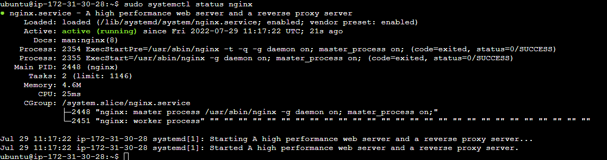
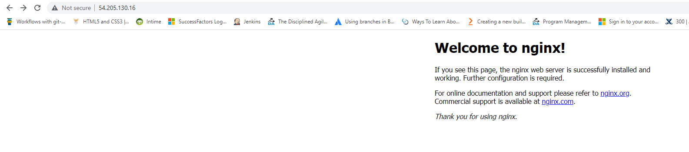
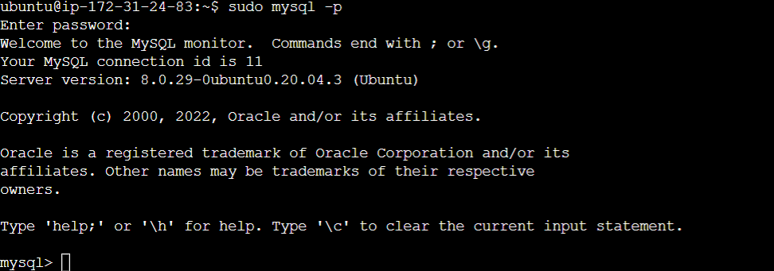
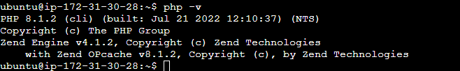
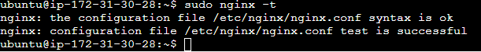
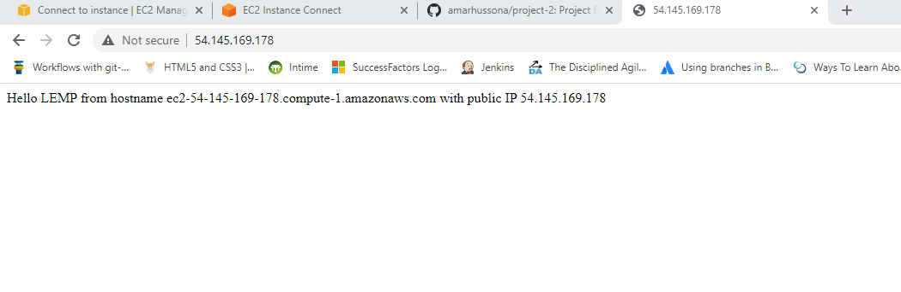
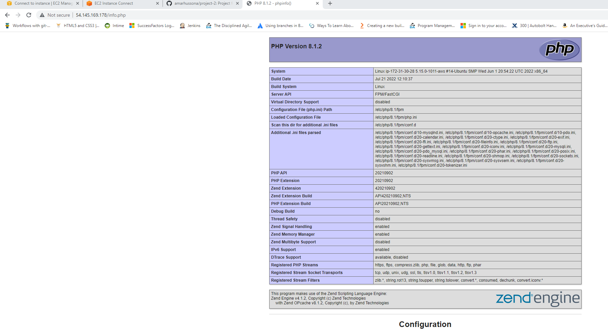
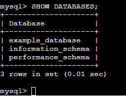
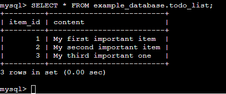
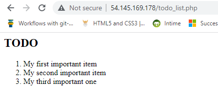

# Documentation for Project 2 (LEMP)

## INSTALLING THE NGINX WEB SERVER:

`sudo apt update`

`sudo apt install nginx`

`sudo systemctl status nginx`

Default Page

## INSTALLING MYSQL:

`sudo apt install mysql-server`

`sudo mysql`

`sudo mysql_secure_installation`

`sudo mysql -p`

## INSTALLING PHP

`sudo apt install php-fpm php-mysql`

`php -v`

## CONFIGURING NGINX TO USE PHP PROCESSOR

`sudo mkdir /var/www/projectLEMP`

`sudo chown -R $USER:$USER /var/www/projectlemp`

`sudo nano /etc/nginx/sites-available/projectLEMP`

Config file:

<!-- #/etc/nginx/sites-available/projectLEMP

server {
    listen 80;
    server_name projectLEMP www.projectLEMP;
    root /var/www/projectLEMP;

    index index.html index.htm index.php;

    location / {
        try_files $uri $uri/ =404;
    }

    location ~ \.php$ {
        include snippets/fastcgi-php.conf;
        fastcgi_pass unix:/var/run/php/php8.1-fpm.sock;
     }

    location ~ /\.ht {
        deny all;
    }

} -->

`sudo ln -s /etc/nginx/sites-available/projectLEMP /etc/nginx/sites-enabled/`

`sudo nginx -t`

`sudo unlink /etc/nginx/sites-enabled/default`

`sudo systemctl reload nginx`

`sudo echo 'Hello LEMP from hostname' $(curl -s http://169.254.169.254/latest/meta-data/public-hostname) 'with public IP' $(curl -s http://169.254.169.254/latest/meta-data/public-ipv4) > /var/www/projectLEMP/index.html`

## TESTING PHP WITH NGINX

`sudo nano /var/www/projectLEMP/info.php`

`<?php
phpinfo();`

`sudo rm /var/www/projectlamp/index.php`

## RETRIEVING DATA FROM MYSQL DATABASE WITH PHP

`mysql> CREATE DATABASE `example_database`;`

`mysql>  CREATE USER 'example_user'@'%' IDENTIFIED WITH mysql_native_password BY 'password';` 

<!-- I used a differnt password  -->

`mysql> GRANT ALL ON example_database.* TO 'example_user'@'%';`

Exit

`mysql -u example_user -p`

`mysql> SHOW DATABASES;`

<!-- CREATE TABLE example_database.todo_list (
		item_id INT AUTO_INCREMENT,
		content VARCHAR(255),
		PRIMARY KEY(item_id)
			); -->

`mysql> INSERT INTO example_database.todo_list (content) VALUES ("My first important item");`

`mysql>  SELECT * FROM example_database.todo_list;`

Exit

`nano /var/www/projectLEMP/todo_list.php`

Copy and make sure password matches:

<!-- <?php
$user = "example_user";
$password = "password";
$database = "example_database";
$table = "todo_list";

try {
  $db = new PDO("mysql:host=localhost;dbname=$database", $user, $password);
  echo "<h2>TODO</h2><ol>";
  foreach($db->query("SELECT content FROM $table") as $row) {
    echo "<li>" . $row['content'] . "</li>";
  }
  echo "</ol>";
} catch (PDOException $e) {
    print "Error!: " . $e->getMessage() . " ";
    die();
} -->

`http://54.145.169.178/todo_list.php`

Nice!

